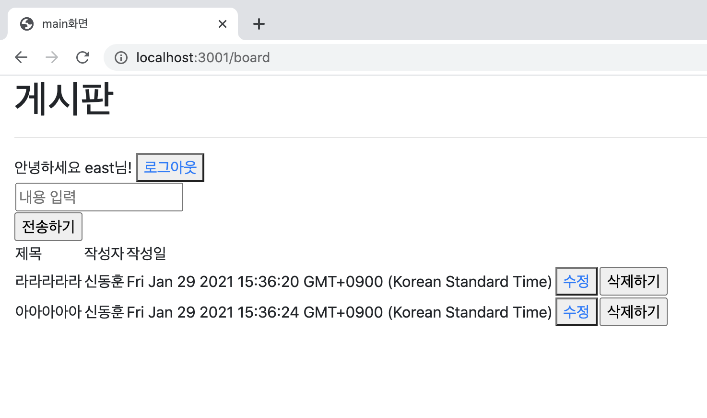
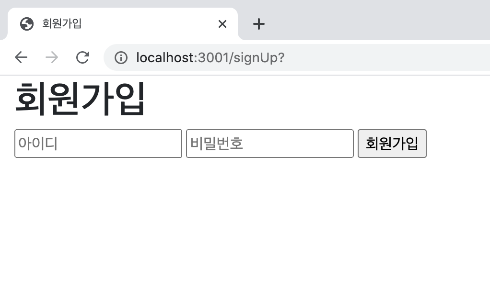

## Board Service

Board Service implementing Login and CRUD
---

#### What is used
* Framework: Express
* DataBase: MySQL

#### What can it do?
* Can log-in(Local, Kakao)
* When accessing the board without logging-in, no access
* Can create, modify, and delete board articles
* Cannot modify and delete articles that is not written with the ID you are currently logged in.

#### ScreenShot
1. Home

2. Sign Up

3. Board

